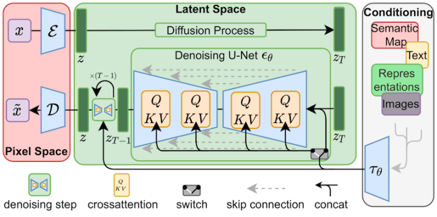
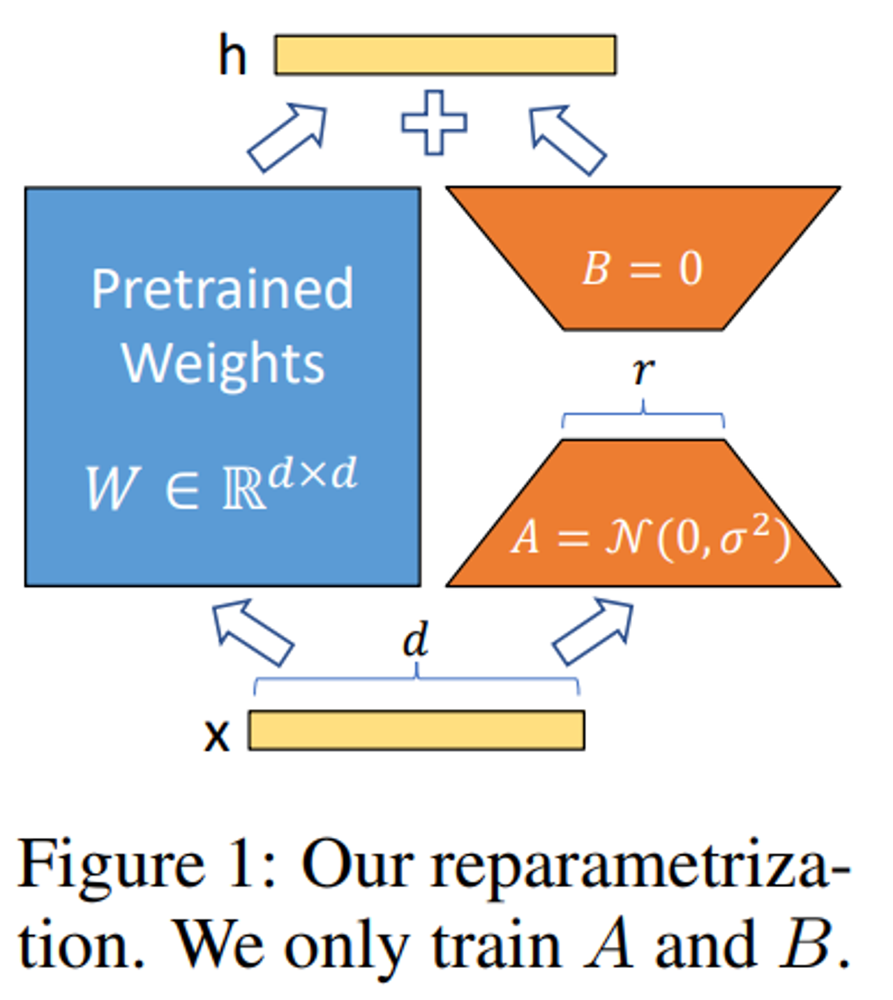
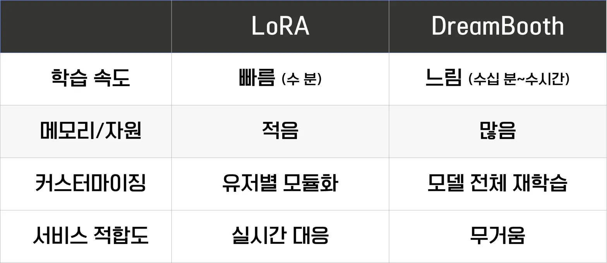
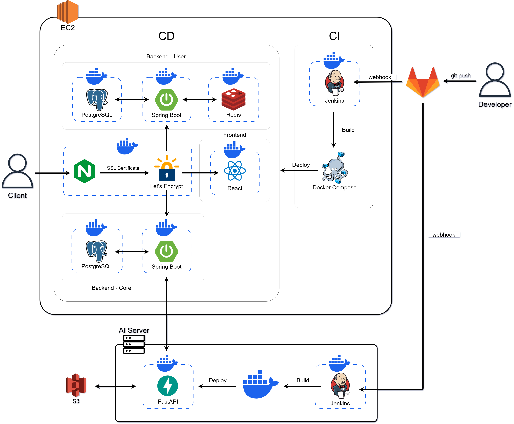
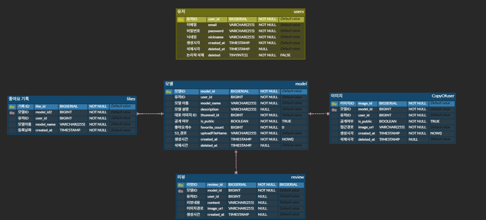

# 아트퐁 (Art-Form)
> 📅 **프로젝트 기간:** 2025.03.04 ~ 2025.04.05  
> **👥 팀명:** 삼시두끼  


## 프로젝트 소개

**아트퐁 (Art-Form)은** AI가 당신의 그림을 배우고,  
일상 속 사진을 나만의 예술 스타일로 바꿔주는 **화풍 변환 서비스**입니다.  
그림을 몇 장만 업로드하면, AI가 당신만의 화풍을 학습하고  
사진을 마치 한 편의 작품처럼 손쉽게 변환해줍니다.  
**누구나 쉽게, 나만의 감성을 담은 예술을 만들 수 있어요.**

## 서비스 대상자

- **자신만의 예술 스타일을 만들고 싶은 사용자**
    - AI가 사용자의 그림을 학습하여 개성 있는 화풍을 자동으로 적용해 줍니다.
- **창작 활동을 간편하게 즐기고 싶은 일반 사용자**
    - 복잡한 편집 없이 원하는 이미지를 간편하게 변환할 수 있어, 누구나 예술적인 결과물을 만들 수 있습니다.

**전문가가 아니어도 쉽게 사용할 수 있도록 직관적인 인터페이스와 AI 기반 자동화 기능을 제공**하여, 미술을 좋아하는 모든 사람이 부담 없이 창작을 즐길 수 있도록 도와줍니다.


## **주요 기술 스택**
### ✔️ Front-End  
    

### ✔️ Back-End    
     

### ✔️ AI 모델링  
     

### ✔️ Database  
   

### ✔️ Infra / DevOps  
     

## 서비스 설명 / 주요 기능
### 🧐 어떤 서비스인가요?  
직접 선택한 사진을 **사용자가 원하는 화풍으로 바꿔주는 서비스**입니다!
- 사용자가 직접 그린 약 10장의 그림을 업로드하면, AI가 개인의 화풍을 학습하여 이를 바탕으로 사진 촬영 시 전체 이미지를 학습된 화풍으로 변환해주는 서비스입니다.  
누구나 손쉽게 자신만의 예술적 스타일을 반영한 사진을 제작할 수 있습니다.

### **🖼️ 주요 기능**
1. 약 10장의 그림을 업로드하여 AI가 개인 화풍 학습
2. Stable-Diffusion + LoRA 기반 맞춤형 화풍 모델 생성
3. 사용자 전용 화풍 모델 저장 및 관리
4. 모델 공유 및 인기 화풍 랭킹 제공 (커뮤니티 기능)
5. 화풍을 적용한 이미지 결과물 생성 및 다운로드

### 🔍 기능 상세 설명
**1️⃣ 개인화된 화풍 학습**
- 사용자가 직접 그린 약 10장의 그림을 업로드하면, AI가 이를 학습하여 개인 맞춤형 화풍 모델을 생성합니다.
- Stable-Diffusion과 LoRA 기반의 Transfer Learning 기법을 활용해 소량의 이미지로도 맞춤형 화풍 모델을 효과적으로 생성합니다.

**2️⃣ 화풍 모델 저장 및 공유**
- 학습된 화풍 모델은 사용자 계정에 저장되어 재사용할 수 있으며, 선택적으로 커뮤니티에 공개하여 공유할 수 있습니다.
- 공개된 화풍 모델은 인기 순 랭킹으로 정렬되어, 다른 사용자들이 쉽게 탐색하고 사용할 수 있도록 지원합니다.

**3️⃣ 스타일 변환 및 이미지 다운로드**
- 학습된 화풍을 원하는 사진에 적용하면, AI가 해당 이미지 전체를 예술적인 스타일로 변환합니다.
- 완성된 결과물은 다운로드 기능을 통해 저장이 가능합니다.

### **✨ 프로젝트의 특장점(기능 관점)**
- 나만의 화풍을 반영한 예술 이미지 생성
- 커뮤니티 기반 화풍 공유 및 추천 시스템
- 복잡한 과정 없이 누구나 쉽게 사용할 수 있는 인터랙티브 UI
- 소량의 데이터만으로도 고퀄리티 학습 가능한 AI 기술 적용

## 서비스 이용 화면 


## 🖥️ 프론트엔드 기술 및 구현 상세
### ✔️ 기술 스택 선택 이유
- **`React Native + Expo`**  
    - 여러 플랫폼(Android, iOS)에서 동일한 코드베이스로 앱을 개발할 수 있는 크로스 플랫폼 프레임워크입니다.
    - 앱 설치형 사용 경험을 제공하면서도, 빠르게 개발·배포할 수 있는 프로토타입 개발 최적화 환경이 필요했기 때문에 채택했습니다.
    - Expo를 사용해 번들링과 OTA(Over-the-Air) 업데이트를 간편하게 적용할 수 있어, 개발 속도를 빠르게 가져갈 수 있었습니다.  

- **`TypeScript`**  
    - 프로젝트 규모가 커지면서 런타임 오류를 줄이고 안정적인 코드 관리를 위해 정적 타입 도입이 필요했습니다.  
    - 다양한 컴포넌트 간 Props 전달 및 API 연동 시 인터페이스 설계가 명확해져 협업 효율성이 크게 향상되었습니다.

### 💡 해결한 문제 및 구현 포인트
**1️⃣ AI 이미지 출력의 대기 시간 이슈 대응**  
- AI 서버에서 화풍 변환 이미지가 생성되기까지 수 초의 지연이 발생했습니다.  
- 이를 해결하기 위해 로딩 상태 관리(UI Feedback) 와 함께, 비동기 요청 처리 구조를 설계했습니다.  
- useEffect + async/await + 상태 기반 조건 렌더링을 통해 사용자 혼란을 줄이고, UX를 부드럽게 만들었습니다.  

**2️⃣ 화풍 업로드~적용까지의 흐름을 유기적으로 연결**   
- 사용자 그림 업로드 → 모델 생성 → 화풍 적용 → 결과물 다운로드로 이어지는 흐름은 복잡했기 때문에,  
프론트단에서 각 단계를 분리된 컴포넌트로 구성하고, 전역 상태를 통해 연결하였습니다.  
- 이를 통해 사용자는 '한 번에 순차적 흐름'처럼 자연스럽게 작업할 수 있도록 UX 흐름을 설계했습니다.

**3️⃣ 결과 이미지 미리보기 최적화**  
- AI 결과물은 고해상도 이미지로 반환되며, 성능 저하 가능성이 있었습니다.  
- Image 컴포넌트에 lazy loading과 해상도 자동 조절을 적용하여 렌더링 부하를 줄였습니다.  
- 또한 Expo의 FileSystem 모듈을 활용해 로컬에 저장된 이미지 캐싱을 구현했습니다.

**4️⃣ API 연동 및 사용자 데이터 관리**  
- FastAPI 기반의 AI 서버와 통신하기 위해 Axios 커스텀 인스턴스를 사용했습니다.  
- accessToken 기반 인증이 필요한 API는 인터셉터로 토큰을 주입하고, 실패 시 리프레시 로직까지 처리했습니다.  
- 사용자별 화풍 모델 및 이미지 결과물 관리가 용이하도록 상태 관리에는 React Context + useReducer 구조를 사용했습니다.

### 📱 UI/UX 고려 사항  
- 앱 설치형 느낌을 살리기 위해 Splash Screen과 진입 애니메이션을 추가했습니다.  
- 그림/사진을 업로드하는 흐름은 단계별 인터페이스로 구성하여, 고령 사용자도 직관적으로 사용할 수 있도록 했습니다.  
- 결과물은 다운로드 버튼뿐 아니라 공유 기능까지 제공해 사용성을 높였습니다.

## **🤖 AI 기술**

### **사용자 제공 데이터를 기반으로 개별화된 화풍 학습**

- 사용자가 올린 그림을 바탕으로 **Stable-Diffusion**과 **Lora**를 통해 학습

#### **Stable Diffusion 개요**



Stable Diffusion은 잠재 확산 모델(Latent Diffusion Model)을 기반으로 한 텍스트-이미지 생성 AI 모델입니다. 이 모델은 이미지를 점진적으로 노이즈에서 복원하는 과정을 통해 고품질 이미지를 생성합니다. 주요 특징은 다음과 같습니다:
- 이미지를 픽셀 공간이 아닌 압축된 잠재 공간에서 처리하여 계산 효율성 향상
- 텍스트 프롬프트를 기반으로 이미지 생성 가능
- 오픈소스로 제공되어 다양한 맞춤형 응용 프로그램 개발 가능

#### **LoRA(Low-Rank Adaptation) 기술**



LoRA는 대규모 사전 훈련된 모델을 적은 양의 데이터로 효율적으로 파인튜닝하기 위한 기술입니다:
- 전체 모델 가중치를 업데이트하는 대신 저차원 행렬을 통해 모델을 적응시킴
- 훈련 가능한 매개변수 수를 대폭 줄여 메모리 효율성 향상 및 빠른 학습 속도 제공
- 원본 모델의 가중치는 변경하지 않고 별도의 어댑터로 작동하여 모델 배포 용이

#### **이미지 증강 기법**
사용자로부터 받은 10장의 이미지는 AI 학습에 충분한 데이터가 아닐 수 있습니다. 따라서 다음과 같은 데이터 증강(Data Augmentation) 기법을 활용하여 10장의 원본 이미지를 20장으로 확장합니다.
이러한 증강 기법을 통해 원본 이미지의 특성은 유지하면서 다양한 변형을 생성하여 AI 모델이 화풍의 본질적인 특징을 더 잘 학습할 수 있도록 합니다. 이는 소량의 사용자 데이터로도 높은 품질의 화풍 모델을 학습할 수 있게 해주는 핵심 기술입니다.

**아트퐁에서 LoRA 선택 이유**:




## 프로젝트 구조

```bash

├── frontend/artform # 프론트엔드 폴더
│   ├── app # 라우팅 및 페이지 구성 폴더
│   ├── components # 재사용 가능한 UI 컴포넌트 폴더
│   ├── service # API 통신 및 비즈니스 로직 관련 서비스 폴더
│   ├── package.json # 프로젝트 의존성 및 스크립트 설정 파일
│   ├── .gitignore
│   └── ...
├── backend   # 백엔드 폴더
│   ├── artform-core # 이미지, 리뷰, 모델 서버
│   └── artform-user # 유저 서버
├── ai   # AI 폴더 
│   ├── apply # 추론 파일 
│   ├── train # 학습 파일
│   ├── .gitignore
│   └── ...
├── nginx      # nginx 설정
├── monitoring # 모니터링 설정 
└── README.md # 프로젝트 설명 파일

```

## 시스템 아키텍처



## 🗂️ ERD 다이어그램




## Git Commit Message Convention

커밋 메시지는 아래 규칙을 따릅니다:

- `[FE] feat: 로그인 기능 구현`
- 커밋 유형은 영어 소문자로 작성
- 커밋 메시지는 한글로 작성

| 커밋 유형 | 의미 |
| --- | --- |
| `feat:` | 새로운 기능 추가 |
| `fix:` | 버그 수정 |
| `docs:` | 문서 수정 |
| `style:` | 코드 formatting, 세미콜론 누락, 코드 자체의 변경이 없는 경우 |
| `refactor:` | 코드 리팩토링 |
| `test:` | 테스트 코드, 리팩토링 테스트 코드 추가 |
| `chore:` | 패키지 매니저 수정, 그 외 기타 수정 (예: .gitignore) |
| `design:` | CSS 등 사용자 UI 디자인 변경 |
| `comment:` | 필요한 주석 추가 및 변경 |
| `rename:` | 파일 또는 폴더 명 수정 또는 이동 |
| `remove:` | 파일 삭제 |
| `!BREAKING CHANGE` | 커다란 API 변경 |
| `!HOTFIX` | 치명적인 버그 수정 |
| `merge` | 브랜치 병합 |

## Git Branch 전략

- **master**
    - 최종
    - **user/develop**
        - user/feat/[기능]
        EX ) user/feat/login
        - user/fix/[오류 수정]
    - **core/develop**
        - core/feat/[기능]
        - EX ) core/feat/review
        - core/fix/[오류 수정]
    - **react/develop**
        - react/feat/[기능]
        - EX ) react/feat/login
        - react/fix/[오류 수정]
    - **ai/develop**
        - ai/feat/[기능]
        - EX ) ai/feat/lora
        - ai/fix/[오류 수정]

## 팀원 소개
<table>
  <tbody>
    <tr>
      <td align="center">
        <a href="#"><br />
        <sub><b>AI & Backend : 강대규<br>ethan2024@gmail.com</b></sub></a><br />
      </td>
      <td align="center">
        <a href="#"><br />
        <sub><b>Infra & Backend : 김휘동<br>rlagnlehd0417@gmail.com</b></sub></a><br />
      </td>
      <td align="center">
        <a href="#"><br />
        <sub><b>Backend : 박준현<br>wndrjrak12@gmail.com</b></sub></a><br />
      </td>
    </tr>
    <tr>
      <td align="center">
        <a href="#"><br />
        <sub><b>Frontend : 서현석<br>jacobshs4824@naver.com</b></sub></a><br />
      </td>
      <td align="center">
        <a href="#"><br />
        <sub><b>Frontend : 임정인<br>harperim127@gmail.com</b></sub></a><br />
      </td>
      <td align="center">
        <a href="#"><br />
        <sub><b>Frontend : 정찬우<br>jhanoo@hanyang.ac.kr</b></sub></a><br />
      </td>
    </tr>
  </tbody>
</table>

